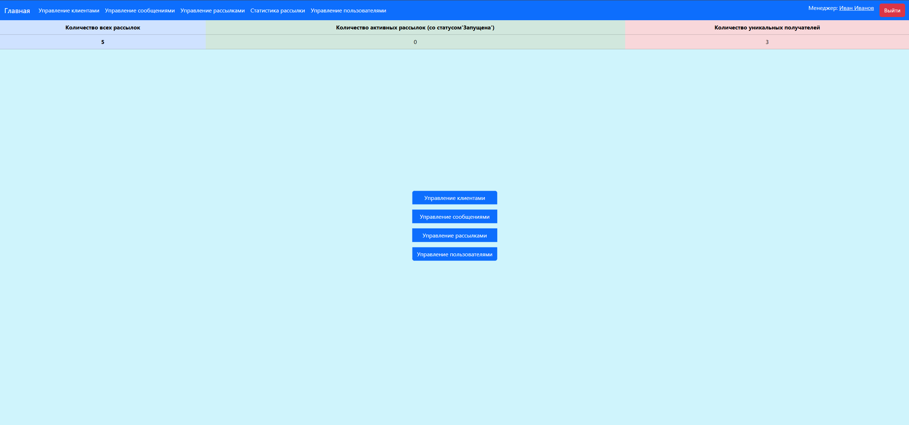

# <p align="center">📨 Mailing Service (Сервис управления рассылками)</p>


Профессиональное веб-приложение на Django для автоматизации email-коммуникаций. Сервис включает полноценную систему регистрации, гибкое управление рассылками и детальную аналитику.

---

##  <p align="center">🚀 Основные возможности</p>

*   **Главная страница:** Динамическая статистика (общее кол-во рассылок, активные рассылки, уникальные клиенты).
*   **Автоматизация:** Запуск рассылок через веб-интерфейс или CLI.
*   **Безопасность:** Регистрация с подтверждением по Email и восстановление пароля.
*   **Модерация:** Специальный интерфейс для менеджеров для управления пользователями и блокировки рассылок.
*   **Производительность:** Серверное и клиентское кеширование данных.

---

##  <p align="center">🛠 Технологический стек</p>

*   **Backend:** Python 3.10+, Django 4.2+
*   **User Model:** Custom AbstractUser (Email, Phone, Avatar, Country).
*   **Performance:** Redis/Memcached (кеширование), клиентское кеширование.
*   **Logging:** Логирование событий уровня `INFO` и выше в файл `debug.log`.

---

##  <p align="center">⚙️ Установка и запуск</p>

1. **Клонируйте репозиторий и установите зависимости:**
   ```bash
   git clone https://github.com/Miles-Bennett-Dyson/Mailing-list-management-service
   cd mailing-service
   poetry update

2. **Настройте окружение:**  
- Создайте .env на основе .env.sample.  
- Важно: В режиме DEBUG=True письма выводятся в консоль.  
3. **Запуск проекта:**  
bash
`python manage.py migrate
python manage.py runserver`

4. Команды управления:  
1. Создать группу менеджеров (+ тестовый аккаунт): python manage.py create_manager_group -u
2. Запуск рассылок через CLI: python manage.py launch_mailing (можно добавить -pk 1 2)

##  <p align="center">🏗 Структура приложений  </p>
1. **👥 users (Центральное приложение)**
   - Регистрация: С обязательным подтверждением почты.
   - Профиль: Расширенная модель (телефон, аватар, страна).
   - Главная страница: Отображает агрегированную статистику по всему сервису.
   - Админ-панель менеджера: Отдельная страница для управления списком пользователей.  
3. 📱 **clients**
   - Управление получателями (Email, ФИО, Комментарий).
   - Права доступа контролируются автором или менеджером (can_view_all_clients).  
4. ✉️ **messages_for_clients**
   - Модель Message: Тема письма, тело письма, автор.
   - Доступ: Автор или менеджер с правом can_view_all_message.

5.  🚀 **message_sender**
   - Mailing: Настройка времени, статуса и состава рассылки.
   - Логика управления: Менеджеры могут скрывать (hide_mailing) или активировать рассылки. Скрытая рассылка автоматически получает статус "Завершена".
   - MailingAttempt: Статистика каждой попытки (дата, статус, ответ сервера).

##  <p align="center">🔐 Роли и права доступа</p>
<table align="center" >
  <tr>
     <th> Функция</th>
     <th> Пользователь</th>
     <th> Менеджер (группа 'Managers')   </th>
  </tr>
  <tr>
     <th>Управление своими клиентами/рассылками</th>
     <th>✅</th>
    <th>❌ (только просмотр)</th>
  </tr>
    <tr>
     <th>Просмотр всех рассылок и клиентов</th>
     <th>❌</th>
    <th>✅</th>
  </tr>
      <tr>
     <th>Просмотр списка всех пользователей</th>
     <th>❌</th>
    <th>✅(can_view_list_users)</th>
  </tr>
      <tr>
     <th>Блокировка пользователей</th>
     <th>❌</th>
    <th>✅</th>
  </tr>
  <tr>
     <th>Отключение (скрытие) рассылок</th>
     <th>❌ </th>
    <th>✅ (can_hide_mailing)</th>
  </tr>
    <tr>
     <th>Просмотр статистики</th>
     <th>Своя</th>
    <th>Общая</th>
  </tr>
</table>

##  <p align="center">📈 Производительность и мониторинг  </p>
- Кеширование: Для снижения нагрузки на БД используется кеширование ключевых страниц и запросов.
- Логирование: Все важные действия системы фиксируются в debug.log. Пример записи:  
```text
INFO:mailing: Рассылка ID 5 запущена успешно.
ERROR:mailing: Ошибка отправки на email@test.com: [Ответ сервера]
